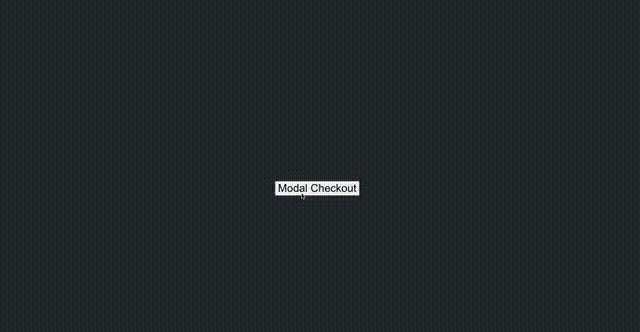
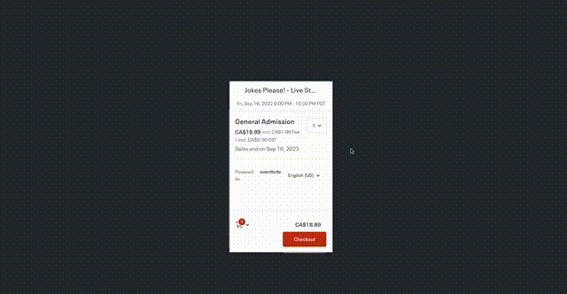

# React Eventbrite Checkout
[](https://badge.fury.io/js/react-eventbrite-popup-checkout)

A React component that loads and wraps Eventbrite's checkout widgets.

## Install
If using NPM:
```
$ npm install react-eventbrite-popup-checkout --save
```

If using Yarn:
```
$ yarn add react-eventbrite-popup-checkout
```

## Usage
**Note:** In-app checkout will only trigger when your app is served with **HTTPS**. Otherwise, the component directs the user to Eventbrite's website to complete the purchase.

### Modal Example


Create a button that triggers a checkout modal.

```jsx
import React from 'react';
import useEventbrite from 'react-eventbrite-popup-checkout';

const App = () => {
  const handleOrderCompleted = React.useCallback(() => {
    console.log('Order was completed successfully');
  }, []);
  const modalButtonCheckout = useEventbrite({
    eventId: 'YOUR-EB-EVENT-ID',
    modal: true,
    onOrderComplete: handleOrderCompleted,
  });
  
  return (
    <div id="my-app">
      {/* guard for null - resolves when Eventbrite loads */}
      {modalButtonCheckout && (
        <button id={modalButtonCheckout.id} type="button">
          Modal Checkout
        </button>
      )}
    </div>
  )
};
```

### Embedded iFrame Example


Embed an iFrame checkout.

```jsx
import React from 'react';
import useEventbrite from 'react-eventbrite-popup-checkout';

const App = () => {
  const handleOrderCompleted = React.useCallback(() => {
    console.log('Order was completed successfully');
  }, []);
  const iframeCheckout = useEventbrite({
    eventId: 'YOUR-EB-EVENT-ID',
    modal: false,
    onOrderComplete: handleOrderCompleted,
    iFrameHeight: 500, // optional
    iFrameAutoAdapt: 100, // optional - The widget's viewport percentage (between 75-100)
  });
  
  return (
    <div id="my-app">
      {/* guard for null - resolves when Eventbrite loads */}
      {iframeCheckout && (
        <div id={iframeCheckout.id} />
      )}
    </div>
  )
};
```

### Auto Apply Promo Code
You can pass `promoCode` to the `useEventbrite` hook to automatically apply a promo code during checkout.
